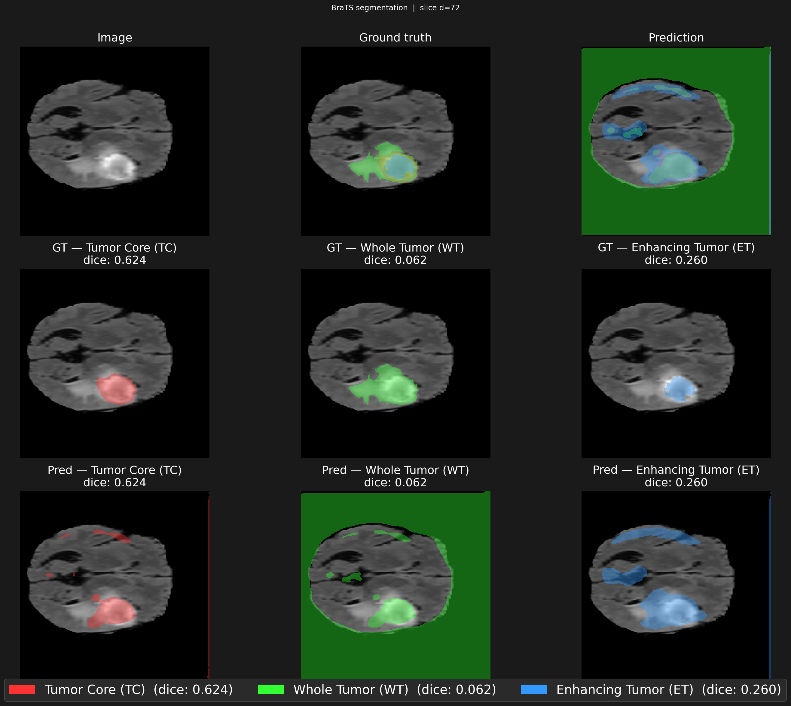

Main notebook for used to for training, relevant for reproducibility. Ideal for use in a cloud compute setting with access to high end GPUs (A100, H100, B100). It uses the MONAI data loader to ingress data. Initially, download of imaging data will be required to the appropriate environment.
```bash
jupyter notebook U-Transformer/u-transformer-multi-modal-train.ipynb
```
Run the pre-trained model for inference:
```bash
pip install -r requirement.txt
python inference.py
```
The `utils.py` file contains `visualize_mosaic` method for generating cross-sectionally QC mosaic of predicted mask vs ground truth. Example:
